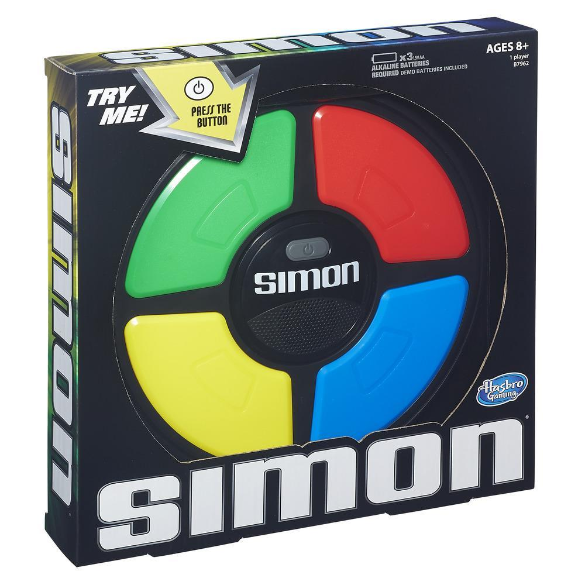
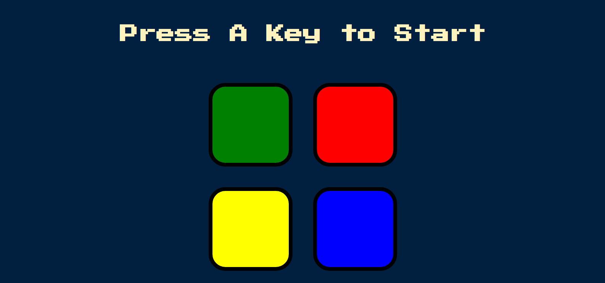

# simon-game

<h3 align="left">Languages and Tools:</h3>

 
 
 
 
 
<a href="https://jquery.com/" target="_blank" rel="noreferrer"  </a>
 

This is a simple frontend project which is built while learning full-stack web development by Dr.Angela yu the course is called  [The Complete 2022 Web Development Bootcamp](https://www.udemy.com/course/the-complete-web-development-bootcamp/) this is the best-seller course in web development on Udemy

## In this project, I Build the simon game
The Simon game is the exciting electronic game of lights and sounds in which players must repeat random sequences of lights by pressing the colored pads in the correct order. It's fast-paced play, with lights and sounds that can challenge you. Experience the fun as you repeat the patterns and advance to higher levels

## A live link
[click here to see the live web](https://melakudemeke.github.io/simon-game/)

## Result of the code

